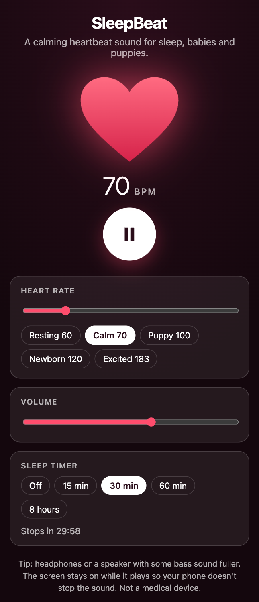

# SleepBeat

A free, calming **heartbeat sound** you can loop all night, for sleep, newborns, puppies, focus and relaxation. No ads, no sign-up, no tracking. Everything runs in your browser.

**Live demo:** [umar8092.github.io/sleepbeat](https://umar8092.github.io/sleepbeat/)



## What you can do

- **Play a soft "lub-dub" heartbeat** made in the browser with the Web Audio API. No audio files.
- **Loop it all night.** It plays until you pause it.
- **Set the heart rate from 40 to 200 BPM**, with presets: Resting 60, Calm 70, Puppy 100, Newborn 120 and Excited 183. Change it while it plays.
- **Set a sleep timer** (15 min, 30 min, 60 min or 8 hours) that fades the sound out gently.
- **Control the volume.**
- **Watch a heart pulse in time** with each beat.
- **Keep the screen awake** while playing (on browsers that support it), so a phone doesn't stop the sound.
- **Play and pause with the spacebar.**
- It remembers your heart rate and volume.

## Good for

Sleep, settling a newborn, comforting a new puppy or kitten, studying, meditation, and as a free looping sound effect for videos, games and podcasts.

## Tips

- Phone and laptop speakers are weak at deep bass. The sound is tuned to work on small speakers, but headphones or a speaker with some bass will sound fuller.
- Browsers stop web audio when a phone screen locks. The screen stays on while the app plays, so leave the phone plugged in overnight.
- For a baby or a pet, keep the volume low and the speaker a few feet away, never inside a crib or bed.
- A heartbeat sound is a comfort aid, not a medical device or a treatment for sleep problems.

## Run it yourself

No build step and no dependencies.

```bash
git clone https://github.com/umar8092/sleepbeat.git
```

Open `index.html` in your browser.

## How it works

`beat.js` builds each thump from two sine waves plus a short burst of filtered noise, softened by a low-pass filter. The "dub" follows the "lub" after a gap that shrinks as the heart rate rises. `script.js` schedules beats a fraction of a second ahead of the audio clock, so the rhythm stays steady and heart-rate changes take effect on the very next beat. A quick second tap on the play button is ignored, so a double tap can never start a second loop on top of the first.

To check the sound without speakers, open `test.html` in a browser. It renders the heartbeat offline and verifies that each beat has two thumps, the timing is right at several heart rates, nothing clips, and most of the energy is in the low frequencies.

## License

[MIT](LICENSE). Free to use, copy, modify and share. Made by [Muhammad Umar](https://github.com/umar8092).
